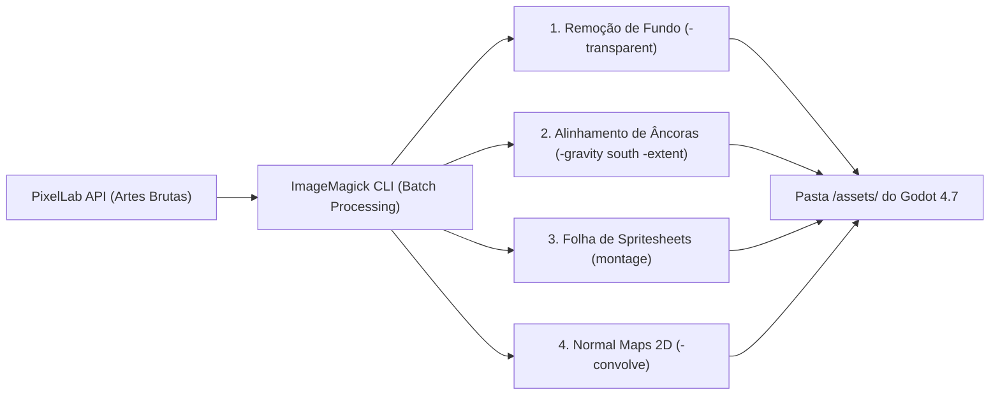

# 🖼️ Diretriz Permanente: Uso do ImageMagick CLI no Projeto HELIOS

> **REGRA MANDATÓRIA PARA TODOS OS AGENTES (Gemini 1, Gemini 2, Gemini 3, GLM 5.2)**:
> O **ImageMagick CLI 7.1.2** (`magick` / `C:\Program Files\ImageMagick-7.1.2-Q16-HDRI\magick.exe`) é a ferramenta padrão de pós-processamento e ingestão gráfica do HELIOS.
> À medida que a **API do PixelLab cospe dezenas de artes brutas** (frames, criaturas, props, tilesets), os agentes DEVEM utilizar comandos de terminal do ImageMagick para executar **batch processing instantâneo** (remoção de fundos, montagem de folhas de spritesheets, alinhamento de âncoras/pivôs e quantização) antes de salvar os assets diretamente na pasta `assets/` do projeto Godot.

---

## 🎨 Pipeline Integrada: PixelLab API ➡️ ImageMagick Batch CLI ➡️ Godot `/assets`



---

## ⚡ Comandos Essenciais de Batch Processing para Ingestão de Assets

### 1. Remoção de Fundo em Lote nas Imagens Brutas do PixelLab (`-transparent` / `mogrify`)
Quando a API do PixelLab devolver dezenas de frames com fundo sólido (preto, magenta ou branco):
```powershell
magick mogrify -format png -fuzz 8% -transparent "#000000" raw_frames/*.png
```

### 2. Alinhamento de Âncoras / Pivôs e Padronização de Dimensões (`-gravity south -extent`)
Garante que todos os frames de uma criatura ou astronauta fiquem com os pés exatamente no mesmo plano de chão e com dimensões idênticas (ex: $64\times 64\text{ px}$):
```powershell
magick mogrify -trim +repage -gravity south -background transparent -extent 64x64 raw_frames/*.png
```

### 3. Montagem Instantânea de Folhas de Sprites / Spritesheets (`montage`)
Unifica todos os frames de uma animação (ex: 6 frames de caminhada) em uma única tira horizontal pronta para o `SpriteFrames` ou `AnimationPlayer` do Godot:
```powershell
magick montage raw_frames/walk_*.png -tile 6x1 -geometry 64x64+0+0 -background transparent assets/sprites/characters/astronaut_walk_sheet.png
```

### 4. Geração em Lote de Normal Maps 2D para Forward+ (`-convolve` / Sobel Filter)
Gera mapas de relevo e profundidade para iluminação dinâmica 2D no Godot Forward+:
```powershell
magick input_sprite.png -convolve "-1,-2,-1,0,0,0,1,2,1" -convolve "-1,0,1,-2,0,2,-1,0,1" assets/sprites/normals/input_sprite_normal.png
```

### 5. Quantização e Adequação à Paleta HELIOS 16-Bit (`-colors 16` / `-dither None`)
Garante fidelidade à paleta retro 16-bit do GDD:
```powershell
magick input.png -colors 16 -dither None assets/sprites/items/item_16bit.png
```

---

## 📍 Localização do Binário no Windows
- Comando direto: `magick`
- Caminho absoluto: `& "C:\Program Files\ImageMagick-7.1.2-Q16-HDRI\magick.exe"`
